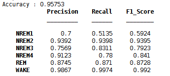

# Sleep Stages Classification by EEG Signals
MATLAB Project to Classify Different Sleep Stages using Machine Learning. This is a simple project and simple classification model, much more can be added and better accuracy can be achieved but no time!

## EEG Signals


## Model Details 

- Alpha, Beta, Theta, Delta, Spi & Saw signals were extracted by bandpass filter applied on EEG data.
- Differencing applied on all the signals.
- Different features were extracted including but not limited to STD, Skewness, Kurtosis, Max, Min, IQR, Mean freq, Median freq, SNR ...
- The label is extracted using the CSV PSG files.
- Two machine learning models were applied:
    - Random Forest RF:
        - 10 cross validation.
        - 300 trees with Min Leaf Size of 1
    - Support Vector Machine:
      - Gaussian Kernel
      - Coarse Grid Search with 5 cross validation (Tune the Parameters for Better Accuracy)
    

## Accuracy
This is the accuracy for 4 files only (Two Subjects & Two Nights)

### Random Forest




### Support Vector Machine


Note: Not fully tuned ...


## Hypnogram Data Extraction
A simple python script has been written to extract the Hypnogram data into CSV. It takes one parameter which is the directoy in which files exist.

```python
#!/usr/bin/env python3
import pyedflib
import os
import sys

print(sys.argv[1])

for fileName in os.listdir(sys.argv[1]):
        if fileName.endswith("-Hypnogram.edf"):
                filePath = os.path.join(sys.argv[1], fileName)
                f = pyedflib.EdfReader(filePath)
                annotations1 = f.readAnnotations()
                filePath = filePath.replace("-Hypnogram.edf", ".csv")
                with open(filePath, 'w') as fileCSV:
                        for d in range(len(annotations1[0])):
                                fileCSV.write(str(annotations1[0][d])+','+str(annotations1[1][d])+','+ annotations1[2][d].replace("S>
```
Note: You need to install `pyedflib` package (`pip3 install pyedflib`).


## Code Structure
- data
    - Contains the *PSG.edf files whcih are whole-night polysmnographic sleep recordings
- hypno
    - Contains the *Hypnogram.edf files which contain annotations of the sleep patterns that correspond to the PSGs. These patterns (hypnograms) consist of sleep stages W, R, 1, 2, 3, 4, M (Movement time) and ? (not scored).
- feature_extractions
    - Features matrix extraction code including the label extraction code and the edfread functions
    - EDF READ: https://www.mathworks.com/matlabcentral/fileexchange/31900-edfread
- classifiers
    - Contains two codes for two classification algorithms, namly, RF and SVM.
- plot
    - A simple code to plot different frequencies of the EEG signal

## Dataset
B Kemp, AH Zwinderman, B Tuk, HAC Kamphuisen, JJL Oberyé. Analysis of a sleep-dependent neuronal feedback loop: the slow-wave microcontinuity of the EEG. IEEE-BME 47(9):1185-1194 (2000).
https://physionet.org/content/sleep-edfx/1.0.0/

## Buy me a Coffee: 
BTC: bc1q2kqvggm552h0csyr0awa2zepdapxdqnacw0z5w


